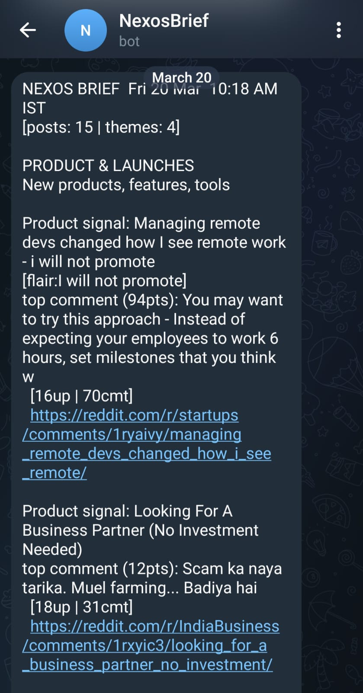

# 🚀 Nexos Brief – Reddit Market Intelligence Pipeline

Automated pipeline that extracts insights from Reddit startup discussions and delivers structured summaries via Telegram.

📌 Deployed on VPS with Docker and runs daily via cron to deliver automated market intelligence summaries.

 🎯 Why This Project

This system transforms unstructured Reddit discussions into structured, actionable market intelligence.

It simulates a lightweight alternative to internal tools used by:
- VC firms
- Market research teams
- Early-stage founders tracking trends

---

## 🔧 Tech Stack
- Python
- Docker
- Reddit API (JSON scraping)
- Telegram Bot API
- VPS Deployment (Hostinger)

---

## ⚙️ Features
- Scrapes top startup posts from multiple subreddits
- Extracts metadata: score, comments, flair, awards
- Fetches and analyzes top comments
- Performs keyword-based thematic clustering
- Generates structured daily intelligence brief
- Sends automated reports to Telegram
- Runs on cron jobs in a VPS environment

---

## 🧠 Pipeline Flow

Reddit → Data Extraction → Comment Analysis → Tagging → Clustering → Summary → Telegram Delivery

---

## 🚀 Deployment
- Containerized using Docker
- Deployed on VPS (Hostinger)
- Scheduled via cron for daily execution

---

## 📸 Output Sample

---

## 📌 Status
✅ Running in production (VPS)  
⚠️ Codebase simplified for public repo  

---

## 👤 Author
Mahith Reddy
